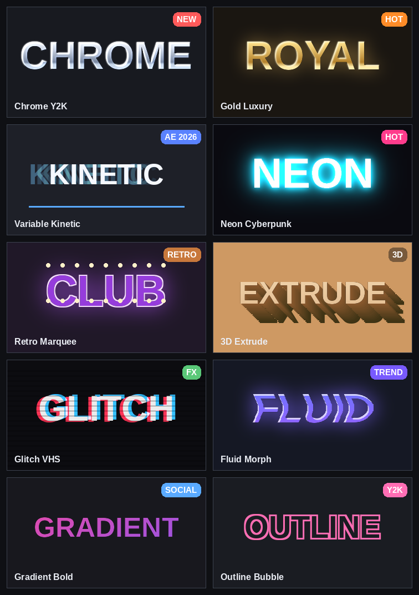

# Text Style Pro Max — Trending Text Styles for After Effects

A dockable **ScriptUI panel** that applies a curated library of trend-driven text
looks to your text layers — with a **live thumbnail preview gallery**, adjustable
color & intensity, favorites, and search.

Built for editors who need great-looking type *fast*. Every style is composed
from **native After Effects layer styles + effects** (using locale-independent
matchNames) — **no third-party plugins, no canned `.ffx` presets**. Each recipe is
hand-tuned and applied inside a single undo group.



---

## ✨ The Style Library (newest / hottest first)

| Style | Category | Trend | What it does |
|-------|----------|-------|--------------|
| **Chrome Y2K** | Metal | 🆕 NEW | Liquid-metal mirror chrome — gradient overlay + chisel bevel + satin sheen + bloom |
| **Gold Luxury** | Metal | 🔥 HOT | Royal gold foil with warm bevel, satin and golden outer glow |
| **Variable Kinetic** | Social | 🆕 AE 2026 | Bold flat fill **+ a per-character kinetic reveal animation** |
| **Neon Cyberpunk** | Neon | 🔥 HOT | Deep-glow neon tube: colored stroke, white core, layered outer glow |
| **Retro Marquee** | Retro | 📈 | Bubbly bulb-sign letters: round bevel, warm glow, ring stroke |
| **3D Extrude** | 3D | 📈 | **Real** stacked-duplicate extrusion (block letters) with beveled face |
| **Glitch VHS** | FX | 📈 | Animated RGB-split + jitter (chromatic aberration) via duplicate channels |
| **Fluid Morph** | FX | 📈 | Liquid wobbling edges (animated Turbulent Displace) + glossy fill + glow |
| **Gradient Bold** | Social | ✅ | Clean 2-color social gradient via b/w Gradient Overlay + Tritone mapping |
| **Outline Bubble** | Retro | ✅ | Hollow Y2K sticker outline: zero fill, thick rounded stroke, soft shadow |

---

## 🚀 Install

1. Copy **`TextStyleProMax.jsx`** *and* the **`assets/`** folder (keep them side by
   side) into your After Effects ScriptUI Panels folder:
   - **Windows:** `C:\Program Files\Adobe\Adobe After Effects <ver>\Support Files\Scripts\ScriptUI Panels\`
   - **macOS:** `/Applications/Adobe After Effects <ver>/Scripts/ScriptUI Panels/`
2. In AE: **Preferences → Scripting & Expressions → Allow Scripts to Write Files
   and Access Network** ✔ (needed to save favorites/prefs).
3. Restart After Effects.
4. Open it from the **Window** menu → `TextStyleProMax.jsx`. Dock it anywhere.

> You can also run it once via **File → Scripts → Run Script File…** — it opens as
> a floating palette.

**Requires After Effects 2024 (24.x) or newer.**

---

## 🎬 How to use

1. Select **one or more text layers** in an open composition.
2. Click a thumbnail in the gallery — it loads into the **Preview** panel.
3. (Optional) Tweak **Primary / Secondary** color and **Intensity** in *Options*.
4. Click **Apply to Selected**.

- **Intensity** scales depth/glow/extrusion (25%–200%).
- Leave a color at its default to use each style's signature color; change it to
  recolor the look.
- **☆ Fav** stars a style; the **Favorites** category collects them.
- Everything is one undo step (`Ctrl/Cmd+Z`).

---

## 🛠 How the styles are built (no plugins, no layer styles)

After Effects does **not** allow scripts to add Layer Styles (`addProperty`
fails), so the engine avoids them entirely and uses only reliably-scriptable
techniques whose results keep the text's alpha intact:

- **Metals (Chrome / Gold / Fluid)** → **Bevel Alpha** creates real 3D shading on
  the letters, then **Tritone** remaps that shading to a metal palette (dark →
  mid → highlight), plus a **Glow** bloom. Genuine metallic shading, no precomp.
- **Gradient Bold** → a true directional **Ramp** on a solid, clipped *inside* the
  letters via an alpha **track matte** (`setTrackMatte`, AE 2023+).
- **Neon / Outline / Retro** → the text layer's own **fill & stroke**
  (TextDocument) + stacked **Glow** effects.
- **3D Extrude** → real duplicated layers stepped & darkened behind a beveled face.
- **Glitch** → duplicate layers recolored to R/B with `wiggle` + `posterizeTime`
  expressions for stepped chromatic jitter.
- **Kinetic** → a text **animator** (Position/Scale/Opacity/Blur) driven by a
  keyframed range-selector offset.

Everything is set by **matchName / effect index**, so the script is
locale-independent. A **Demo Comp** button builds a ready-made editable comp per
style, and an in-panel **⚠ issue log** surfaces any non-fatal errors.

---

## 🔄 Regenerating the preview thumbnails

The gallery images live in `assets/thumbnails/`. To regenerate them:

```bash
pip install Pillow numpy
python3 tools/generate_thumbnails.py
```

---

## 📁 Project layout

```
TextStyleProMax.jsx          # the panel (everything is here)
assets/thumbnails/*.png      # preview gallery images
tools/generate_thumbnails.py # regenerates the thumbnails
docs/                        # screenshots / contact sheet
README.md  CHANGELOG.md
```

## License

MIT — see `LICENSE`.
